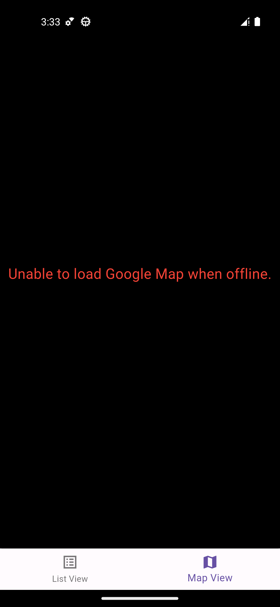

# Moovup Programming Test - Q2 (Dart & Flutter)

## Requirements
- Flutter version 3.19.2 (stable)
- Dart version 3.3.0 (stable)

# Compile
Run commands:
```
flutter pub get
```
For iOS only:
```
cd ios
pod install
```
```
flutter run
```

# Production Ready

## Android
1. Create a *key.properties* file and place it in *android* folder with content
2. <pre>storePassword=testing
keyPassword=testing
keyAlias=moovup_mobile
storeFile=C:\\Users\\jeffrey.leung\\Apps\\keys\\moovup-keystore.jks</pre>
3. Replace the corresponding values with the information of your keystore
4. Run ```flutter run --release``` to vertify it is working

## iOS
1. Set development team in *Signing & Capabilities* in *Xcode*
2. Select *Product* > *Archive*

# Screenshots



